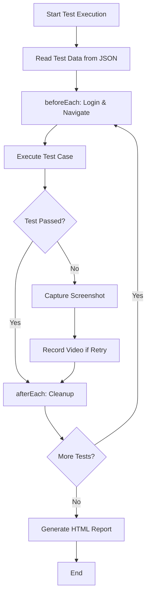

# OrangeHRM Test Automation Framework Documentation

**Project**: OrangeHRM Time Module Test Automation  
**Framework**: Playwright with TypeScript  
**Author**: Dang Ba Qui (21130500)  
**Date**: January 2026  
**Version**: 2.0

---

## Table of Contents

1. [Executive Summary](#executive-summary)
2. [Framework Architecture](#framework-architecture)
3. [Technology Stack](#technology-stack)
4. [Project Structure](#project-structure)
5. [Locator Strategy](#locator-strategy)
6. [Data-Driven Testing](#data-driven-testing)
7. [Test Organization](#test-organization)
8. [Setup and Installation](#setup-and-installation)
9. [Test Execution](#test-execution)
10. [Configuration Management](#configuration-management)
11. [Reporting and Debugging](#reporting-and-debugging)
12. [Best Practices](#best-practices)
13. [Maintenance Guidelines](#maintenance-guidelines)

---

## 1. Executive Summary

This document describes the test automation framework for the OrangeHRM Time Management module. The framework is built using **Playwright** with **TypeScript**, implementing modern testing practices including:

- ✅ **Accessibility-first locator strategies** using `getByRole`, `getByLabel`, `getByText`
- ✅ **Data-driven testing** with JSON test data files
- ✅ **Type-safe code** with TypeScript for better maintainability
- ✅ **Comprehensive test coverage** including positive, negative, boundary, and discovery tests
- ✅ **Automated cleanup** to prevent test data pollution
- ✅ **Rich reporting** with HTML reports, screenshots, and video recordings

### Test Coverage

| Module | Test Cases | Categories |
|--------|-----------|-----------|
| Customer Management | 11 | Positive (2), Negative (3), Discovery/Boundary (6) |
| Project Management | 18 | Project Tests (9), Activity Tests (9) |
| Timesheet Management | 11 | E2E Workflows (2), Positive (2), Negative (7) |
| **Total** | **40** | **Comprehensive coverage** |

---

## 2. Framework Architecture

### 2.1 Architecture Overview

The framework follows a **modular, data-driven architecture** with clear separation of concerns:

```
┌─────────────────────────────────────────────────────────┐
│                   Test Specification Layer               │
│  (test.spec.ts files - Test logic and assertions)       │
└─────────────────────────────────────────────────────────┘
                          ↓
┌─────────────────────────────────────────────────────────┐
│                   Data Layer                             │
│  (JSON files - Test data and expected results)          │
└─────────────────────────────────────────────────────────┘
                          ↓
┌─────────────────────────────────────────────────────────┐
│                   Configuration Layer                    │
│  (config.ts - Environment settings and credentials)     │
└─────────────────────────────────────────────────────────┘
                          ↓
┌─────────────────────────────────────────────────────────┐
│                   Utility Layer                          │
│  (utils.ts - Helper functions and common operations)    │
└─────────────────────────────────────────────────────────┘
                          ↓
┌─────────────────────────────────────────────────────────┐
│                   Playwright Framework                   │
│  (Browser automation, assertions, reporting)            │
└─────────────────────────────────────────────────────────┘
```

### 2.2 Design Principles

1. **Separation of Concerns**: Test logic, test data, and configuration are separated
2. **DRY (Don't Repeat Yourself)**: Common operations are extracted to utility functions
3. **Maintainability**: TypeScript provides type safety and IntelliSense support
4. **Scalability**: Easy to add new test cases by adding JSON data
5. **Readability**: Modern locators make tests self-documenting

---

## 3. Technology Stack

### 3.1 Core Technologies

| Technology | Version | Purpose |
|-----------|---------|---------|
| **Playwright** | ^1.57.0 | Browser automation framework |
| **TypeScript** | Latest | Type-safe programming language |
| **Node.js** | Latest | JavaScript runtime |
| **npm** | Latest | Package manager |

### 3.2 Why Playwright?

- ✅ **Cross-browser support**: Chromium, Firefox, WebKit
- ✅ **Auto-wait**: Automatically waits for elements to be ready
- ✅ **Modern locators**: Accessibility-first approach
- ✅ **Powerful debugging**: Trace viewer, inspector, codegen
- ✅ **Rich reporting**: HTML reports with screenshots and videos
- ✅ **Parallel execution**: Fast test execution
- ✅ **TypeScript support**: First-class TypeScript integration

### 3.3 Why TypeScript?

- ✅ **Type safety**: Catch errors at compile time
- ✅ **IntelliSense**: Better IDE support and autocomplete
- ✅ **Refactoring**: Safer code refactoring
- ✅ **Documentation**: Types serve as inline documentation
- ✅ **Maintainability**: Easier to maintain large codebases

---

## 4. Project Structure

```
orangehrm-playwright-with-nodejs/
│
├── tests/                              # Test specification files
│   ├── customers/
│   │   └── customer.spec.ts           # Customer management tests (11 TCs)
│   ├── projects/
│   │   └── projects.spec.ts           # Project management tests (18 TCs)
│   └── timesheets/
│       └── timesheets.spec.ts         # Timesheet management tests (11 TCs)
│
├── test-data/                          # Test data in JSON format
│   ├── customers_data.json            # Customer test scenarios
│   ├── projects_data.json             # Project test scenarios
│   └── timesheet_data.json            # Timesheet test scenarios
│
├── config/
│   └── config.ts                      # Environment configuration
│
├── utils/
│   └── utils.ts                       # Utility functions
│
├── screenshots/                        # Test failure screenshots
│   ├── customers/
│   ├── projects/
│   └── timesheets/
│
├── test-results/                       # Test execution results
├── playwright-report/                  # HTML test reports
│
├── directives/                         # 3-layer architecture (SOPs)
├── execution/                          # 3-layer architecture (scripts)
├── .tmp/                              # Temporary files
│
├── playwright.config.ts               # Playwright configuration
├── tsconfig.json                      # TypeScript configuration
├── package.json                       # Dependencies and scripts
└── README.md                          # Project documentation
```

### 4.1 File Naming Conventions

- **Test files**: `*.spec.ts` (e.g., `customer.spec.ts`)
- **Test data**: `*_data.json` (e.g., `customers_data.json`)
- **Configuration**: `config.ts`
- **Utilities**: `utils.ts`

---

## 5. Locator Strategy

### 5.1 Locator Priority

The framework follows Playwright's recommended locator strategy, prioritizing accessibility:

| Priority | Locator | Use Case | Example |
|----------|---------|----------|---------|
| **1** | `getByRole()` | Buttons, links, inputs with roles | `page.getByRole('button', { name: 'Login' })` |
| **2** | `getByLabel()` | Form inputs with labels | `page.getByLabel('Name')` |
| **3** | `getByText()` | Elements with visible text | `page.getByText('Successfully Saved')` |
| **4** | `getByPlaceholder()` | Inputs with placeholders | `page.getByPlaceholder('Username')` |
| **5** | `locator()` | Last resort (CSS/XPath) | `page.locator('form input').first()` |

### 5.2 Why Accessibility-First Locators?

- ✅ **Resilient**: Less likely to break with UI changes
- ✅ **Readable**: Self-documenting code
- ✅ **Accessibility**: Ensures app is accessible
- ✅ **Best practice**: Recommended by Playwright

### 5.3 Examples

```typescript
// ✅ GOOD: Using getByRole
await page.getByRole('button', { name: 'Add' }).click();
await page.getByRole('button', { name: 'Save' }).click();

// ✅ GOOD: Using getByLabel
await page.getByLabel('Name').fill('ABC Corporation');

// ✅ GOOD: Using getByText
await expect(page.getByText('Successfully Saved')).toBeVisible();

// ✅ GOOD: Using getByPlaceholder
await page.getByPlaceholder('Username').fill('Admin');

// ⚠️ USE SPARINGLY: CSS selectors
await page.locator('form input').first().fill('Customer Name');
```

---

## 6. Data-Driven Testing

### 6.1 Approach

All test data is stored in **JSON files** in the `test-data/` directory. This approach provides:

- ✅ **Separation of test logic and test data**
- ✅ **Easy to add new test cases** without modifying code
- ✅ **Centralized test data management**
- ✅ **Support for multiple test scenarios**

### 6.2 Test Data Structure

Each JSON file follows this structure:

```json
{
  "test_suite": "Module Name",
  "description": "Description of test suite",
  "test_cases": {
    "TC_ID": {
      "test_name": "Test case description",
      "category": "positive|negative|boundary|discovery",
      "test_data": {
        "field1": "value1",
        "field2": "value2"
      },
      "expected_result": "Expected outcome",
      "expected_error": "Expected error message (if negative)"
    }
  }
}
```

### 6.3 Example: Customer Test Data

```json
{
  "test_suite": "Customers Module",
  "description": "Test data for Customer management",
  "test_cases": {
    "CUST_TC01": {
      "test_name": "Add customer with valid name and description",
      "category": "positive",
      "test_data": {
        "customer_name": "ABC Corporation",
        "description": "Leading software development company"
      },
      "expected_result": "Success message displayed"
    }
  }
}
```

### 6.4 Using Test Data in Tests

```typescript
import * as testData from '../../test-data/customers_data.json';

const CUSTOMER_DATA = testData.test_cases;

test('TC01: Add customer with valid data', async ({ page }) => {
    const data = CUSTOMER_DATA.CUST_TC01.test_data;
    const customerName = data.customer_name + '_' + get_current_timestamp();
    
    await page.getByLabel('Name').fill(customerName);
    await page.getByRole('button', { name: 'Save' }).click();
    
    await expect(page.getByText('Successfully Saved')).toBeVisible();
});
```

---

## 7. Test Organization

### 7.1 Test Structure

Each test file follows this structure:

```typescript
import { test, expect } from '@playwright/test';
import { VALID_USERNAME, VALID_PASSWORD, BASE_URL } from '../../config/config';
import * as testData from '../../test-data/module_data.json';
import { get_current_timestamp } from '../../utils/utils';

const TEST_DATA = testData.test_cases;

test.describe('Feature Tests', () => {
    // Setup
    test.beforeEach(async ({ page }) => {
        // Login and navigation
    });

    // Cleanup
    test.afterEach(async ({ page }) => {
        // Delete test data
    });

    // Test cases organized by category
    
    // ==================== POSITIVE TEST CASES ====================
    test('TC01: Positive test', async ({ page }) => {
        // Arrange
        // Act
        // Assert
    });

    // ==================== NEGATIVE TEST CASES ====================
    test('TC02: Negative test', async ({ page }) => {
        // Arrange
        // Act
        // Assert
    });

    // ==================== BOUNDARY TEST CASES ====================
    test('TC03: Boundary test', async ({ page }) => {
        // Arrange
        // Act
        // Assert
    });
});
```

### 7.2 Test Categories

| Category | Purpose | Example |
|----------|---------|---------|
| **Positive** | Valid inputs, happy path | Add customer with valid data |
| **Negative** | Invalid inputs, error handling | Empty name, exceeding max length |
| **Boundary** | Edge cases | Exactly 50 characters, 51 characters |
| **Discovery** | Exploratory testing | Special characters, spaces |

### 7.3 Arrange-Act-Assert Pattern

```typescript
test('TC01: Add customer with valid data', async ({ page }) => {
    // ARRANGE: Prepare test data
    const data = CUSTOMER_DATA.CUST_TC01.test_data;
    const customerName = data.customer_name + '_' + get_current_timestamp();
    
    // ACT: Perform actions
    await page.getByRole('button', { name: 'Add' }).click();
    await page.getByLabel('Name').fill(customerName);
    await page.getByRole('button', { name: 'Save' }).click();
    
    // ASSERT: Verify results
    await expect(page.getByText('Successfully Saved')).toBeVisible();
    await expect(page.getByRole('table')).toContainText(customerName);
});
```

---

## 8. Setup and Installation

### 8.1 Prerequisites

- **Node.js**: Version 18 or higher
- **npm**: Version 9 or higher
- **Git**: For version control
- **IDE**: VS Code (recommended) with Playwright extension

### 8.2 Installation Steps

```bash
# 1. Clone the repository
git clone <repository-url>
cd orangehrm-playwright-with-nodejs

# 2. Install dependencies
npm install

# 3. Install Playwright browsers
npx playwright install

# 4. Verify installation
npx playwright --version
```

### 8.3 IDE Setup (VS Code)

1. Install **Playwright Test for VSCode** extension
2. Install **TypeScript** extension
3. Configure settings:
   ```json
   {
     "playwright.reuseBrowser": true,
     "playwright.showTrace": true
   }
   ```

---

## 9. Test Execution

### 9.1 Run Commands

```bash
# Run all tests
npm test

# Run tests in headed mode (visible browser)
npm run test:headed

# Run tests in debug mode
npm run test:debug

# View HTML report
npm run report

# Generate test code (Codegen)
npm run codegen
```

### 9.2 Run Specific Tests

```bash
# Run specific test file
npx playwright test tests/customers/customer.spec.ts

# Run specific test by name
npx playwright test -g "TC01"

# Run tests in specific browser
npx playwright test --project=firefox
```

### 9.3 Parallel Execution

Tests run in parallel by default for faster execution:

```typescript
// playwright.config.ts
export default defineConfig({
  fullyParallel: true,
  workers: process.env.CI ? 1 : undefined,
});
```

---

## 10. Configuration Management

### 10.1 Playwright Configuration

**File**: [`playwright.config.ts`](file:///d:/University/2025-26/software-testing/orangehrm-playwright-with-nodejs/playwright.config.ts)

```typescript
export default defineConfig({
  testDir: './tests',
  timeout: 0,                    // Unlimited timeout
  fullyParallel: true,           // Parallel execution
  retries: process.env.CI ? 2 : 0,
  
  use: {
    baseURL: 'https://dbqui176-osondemand.orangehrm.com/',
    headless: false,             // Headed mode
    viewport: { width: 1280, height: 968 },
    screenshot: 'only-on-failure',
    video: 'retry-with-video',
    trace: 'on-first-retry',
  },
  
  projects: [
    { name: 'firefox', use: { ...devices['Desktop Firefox'] } },
  ],
  
  reporter: [
    ['html', { outputFolder: 'playwright-report' }],
    ['list'],
    ['json', { outputFile: 'reports/test-results.json' }]
  ],
});
```

### 10.2 Test Configuration

**File**: [`config/config.ts`](file:///d:/University/2025-26/software-testing/orangehrm-playwright-with-nodejs/config/config.ts)

```typescript
// Base URLs
export const BASE_URL = 'https://dbqui176-osondemand.orangehrm.com/';

// Test credentials
export const VALID_USERNAME = 'Admin';
export const VALID_PASSWORD = 'o@M@dO1@SLj0';
export const EMPLOYEE_PASSWORD = '2742003Huong!';
```

---

## 11. Reporting and Debugging

### 11.1 HTML Report

After test execution, view the HTML report:

```bash
npm run report
```

Features:
- ✅ Test results summary
- ✅ Failed test details
- ✅ Screenshots on failure
- ✅ Video recordings on retry
- ✅ Test duration and timing

### 11.2 Screenshots

Screenshots are automatically captured on test failure:

```
screenshots/
├── customers/
│   ├── TC09_LeadingTrailingSpaces.png
│   └── TC11_DuplicateWithSpaces.png
├── projects/
└── timesheets/
```

### 11.3 Debugging Tools

#### Playwright Inspector
```bash
npm run test:debug
```

#### Trace Viewer
```bash
npx playwright show-trace trace.zip
```

#### VS Code Debugging
1. Set breakpoint in test
2. Click "Debug Test" in VS Code
3. Step through code

---

## 12. Best Practices

### 12.1 Locator Best Practices

✅ **DO**: Use accessibility-first locators
```typescript
await page.getByRole('button', { name: 'Save' }).click();
```

❌ **DON'T**: Use fragile CSS selectors
```typescript
await page.locator('#btn-save').click();
```

### 12.2 Assertion Best Practices

✅ **DO**: Use specific assertions
```typescript
await expect(page.getByText('Successfully Saved')).toBeVisible();
```

❌ **DON'T**: Use generic assertions
```typescript
expect(await page.textContent('body')).toContain('Success');
```

### 12.3 Test Data Best Practices

✅ **DO**: Use unique identifiers
```typescript
const customerName = data.customer_name + '_' + get_current_timestamp();
```

❌ **DON'T**: Use static data
```typescript
const customerName = 'ABC Corporation'; // Will fail on duplicate
```

### 12.4 Cleanup Best Practices

✅ **DO**: Clean up test data
```typescript
test.afterEach(async ({ page }) => {
    if (needsCleanup) {
        // Delete created data
    }
});
```

### 12.5 Wait Best Practices

✅ **DO**: Use auto-waiting
```typescript
await page.getByRole('button', { name: 'Save' }).click();
```

❌ **DON'T**: Use arbitrary waits
```typescript
await page.waitForTimeout(5000); // Avoid unless necessary
```

---

## 13. Maintenance Guidelines

### 13.1 Adding New Test Cases

1. **Add test data** to JSON file:
   ```json
   "NEW_TC": {
     "test_name": "New test case",
     "category": "positive",
     "test_data": { ... }
   }
   ```

2. **Add test** to spec file:
   ```typescript
   test('NEW_TC: Description', async ({ page }) => {
       const data = TEST_DATA.NEW_TC.test_data;
       // Test implementation
   });
   ```

### 13.2 Updating Locators

When UI changes:
1. Run test in debug mode
2. Use Playwright Inspector to find new locator
3. Update test with new locator
4. Prefer `getByRole` over CSS selectors

### 13.3 Handling Flaky Tests

1. **Identify root cause**: Network, timing, or test data issue
2. **Add proper waits**: Use `waitForLoadState('networkidle')`
3. **Improve assertions**: Use more specific locators
4. **Retry mechanism**: Configure retries in `playwright.config.ts`

### 13.4 Code Review Checklist

- [ ] Uses accessibility-first locators
- [ ] Follows Arrange-Act-Assert pattern
- [ ] Has proper cleanup in `afterEach`
- [ ] Uses unique test data identifiers
- [ ] Has clear test descriptions
- [ ] Includes proper assertions
- [ ] No arbitrary waits

---

## Appendix A: Utility Functions

### get_current_timestamp()

**File**: [`utils/utils.ts`](file:///d:/University/2025-26/software-testing/orangehrm-playwright-with-nodejs/utils/utils.ts)

```typescript
export function get_current_timestamp(): number {
    const now = new Date();
    // Get last 4 digits of timestamp
    return now.getTime() % 10000;
}
```

**Purpose**: Generate unique identifiers for test data to avoid duplicates.

**Usage**:
```typescript
const customerName = `ABC Corporation_${get_current_timestamp()}`;
// Result: "ABC Corporation_1234"
```

---

## Appendix B: Test Execution Workflow



---

## Appendix C: Project Statistics

| Metric | Value |
|--------|-------|
| Total Test Cases | 40 |
| Customer Tests | 11 |
| Project Tests | 18 |
| Timesheet Tests | 11 |
| Test Data Files | 3 |
| Lines of Test Code | ~2,000 |
| Test Coverage | Time Module (Customers, Projects, Timesheets) |
| Bugs Discovered | 2 (Space trimming, Duplicate detection) |

---

## Document Revision History

| Version | Date | Author | Changes |
|---------|------|--------|---------|
| 1.0 | 2025 | Dang Ba Qui | Initial framework documentation |
| 2.0 | Jan 2026 | Dang Ba Qui | Updated to reflect Playwright + TypeScript implementation |

---

**End of Document**
